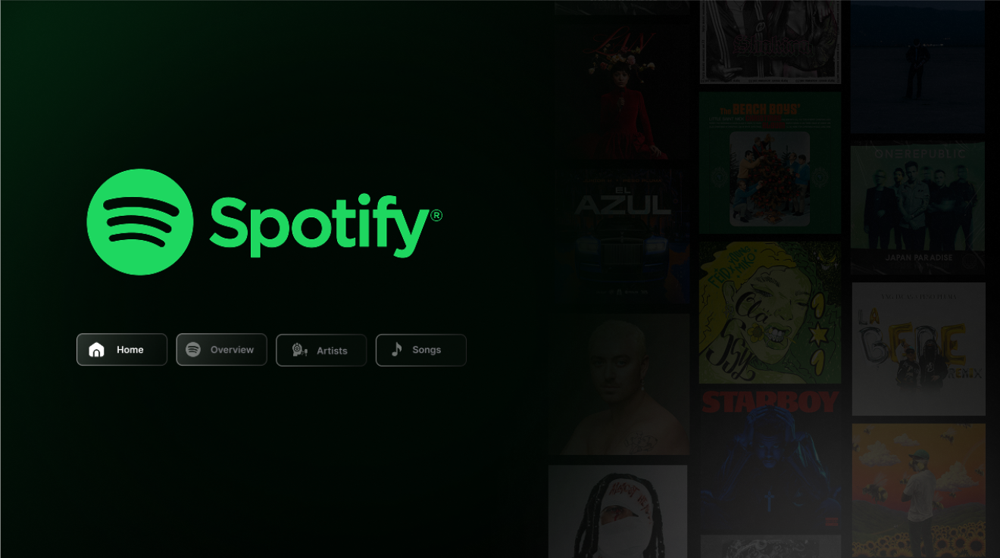
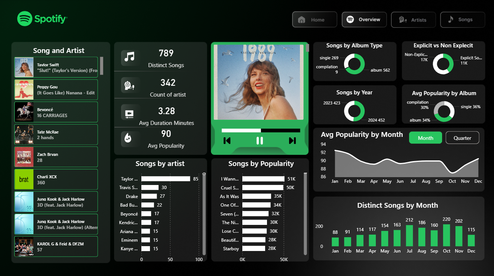
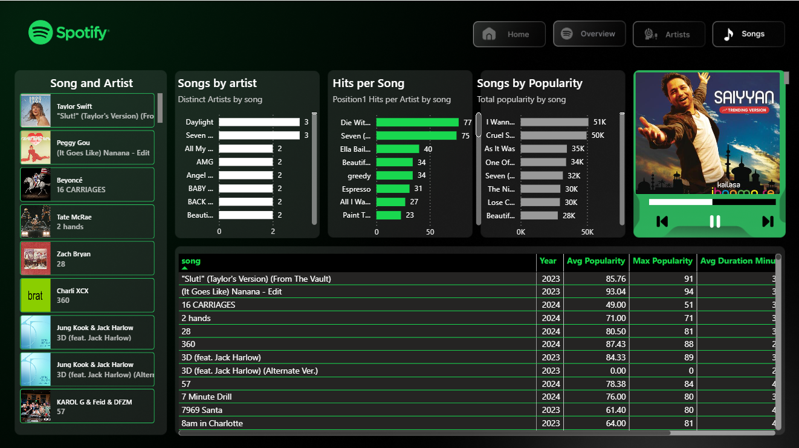
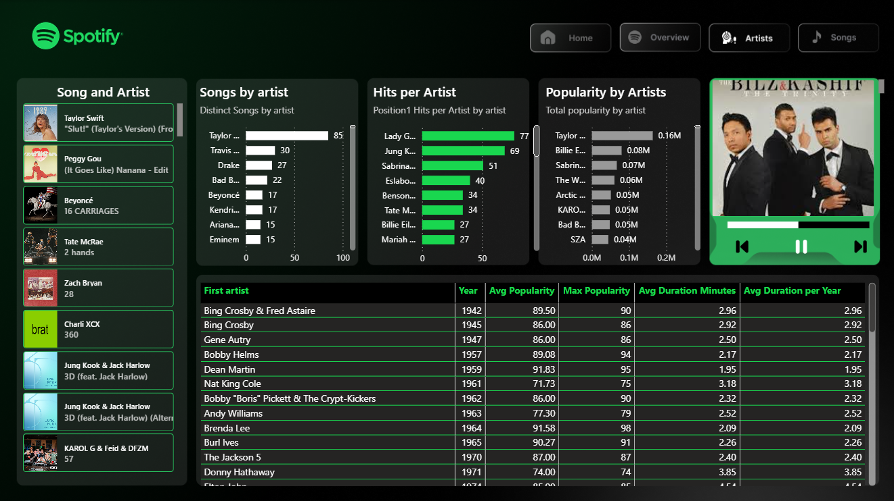

🎧 Spotify Music Analytics Dashboard

  

  

  

  

📊 Project Overview
Created an interactive dashboard to analyze global music streaming data and uncover trends in song popularity, artist performance, and listener preferences.

🔍 Key Insights & Analysis

🎤 Identified top artists and most popular tracks globally

📊 Analyzed distribution of song popularity scores

🎼 Explored genre-wise performance trends

⏳ Compared track features and engagement metrics

🌍 Evaluated global listening patterns

🛠️ Tools & Technologies

📊 Power BI

💡 Business Impact

🎯 Provided insights for music recommendation strategies

📈 Helped understand listener behavior and trends

💡 Supported decision-making for content promotion
